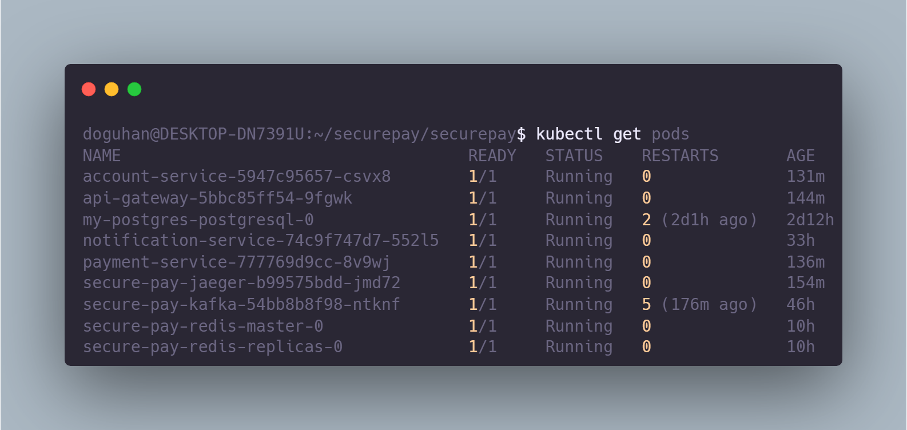
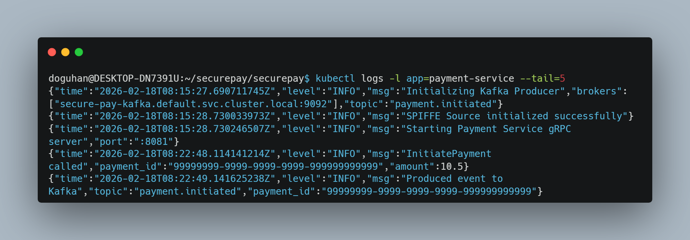
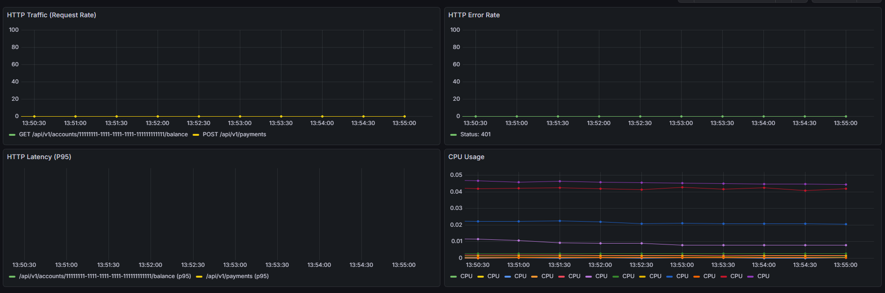
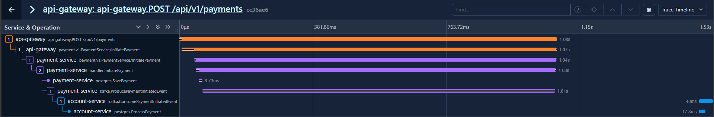

# SecurePay 

**Zero-Trust, Event-Driven, Polyglot Fintech Platform**

SecurePay is a demonstration of a production-grade microservices architecture, featuring mutual TLS (mTLS) via SPIFFE/SPIRE, event-driven communication with Kafka, distributed tracing with OpenTelemetry, and GitOps-ready infrastructure.

---

##  Getting Started

Follow these steps to run the complete platform locally using Minikube.

### Prerequisites
- **Docker** & **Minikube** (with Docker driver)
- **Helm** (v3.12+)
- **Go** (1.24+) & **Java** (JDK 21)
- **kubectl**

### 1. Start Infrastructure
Initialize the Kubernetes cluster and deploy core components (SPIRE, Kafka, Redis, Jaeger).

```bash
# Start Minikube
make start
eval $(minikube docker-env)

# Install All Infrastructure
make infrastructure
```

### 2. Build & Deploy Services
Build the Docker images locally (inside Minikube's Docker daemon) and deploy the services.

```bash
# Build Services
make build

# Deploy to Kubernetes
make deploy
```

### 3. Verify Deployment
Check that all pods are running and services are healthy.

```bash
make verify
# Expected: All services Running (1/1) and Ready
```

### 4. Test the Flow
Run the end-to-end test script to simulate a payment transaction.

```bash
make test
# This runs scripts/test_payment.sh
```

## Screenshots






## 📚 Documentation
For detailed architecture, API specs, and design decisions, see the [local documentation site](docs/index.html).

- **Dashboard**: [docs/index.html](docs/index.html)
- **Architecture**: [docs/architecture.html](docs/architecture.html)
- **Roadmap**: [docs/roadmap.html](docs/roadmap.html)
